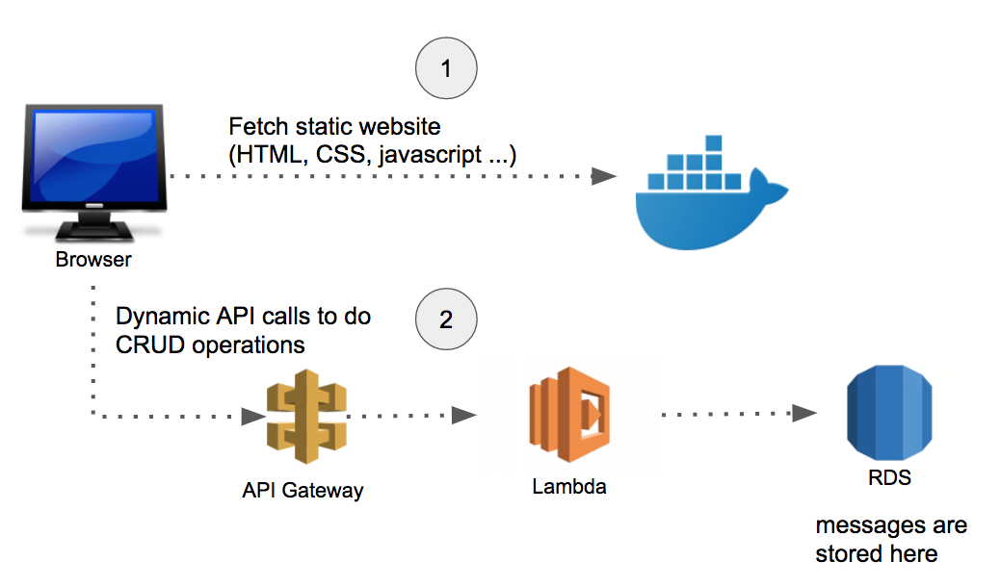

# Message Board

A simple message board where anyone can edit any messages on the board.

This project is built for practicing API gateway, lambda functions, RDS, and docker.

### Architecture

  

## Getting Started

### Prerequisites

### Installing

## Running the tests

### Break down into end to end tests

### And coding style tests

## Deployment

## Built With

## Contributing

## Versioning

We use [SemVer](http://semver.org/) for versioning.

## Authors

* **Brian Lee** 

## License

This project is licensed under the MIT License
